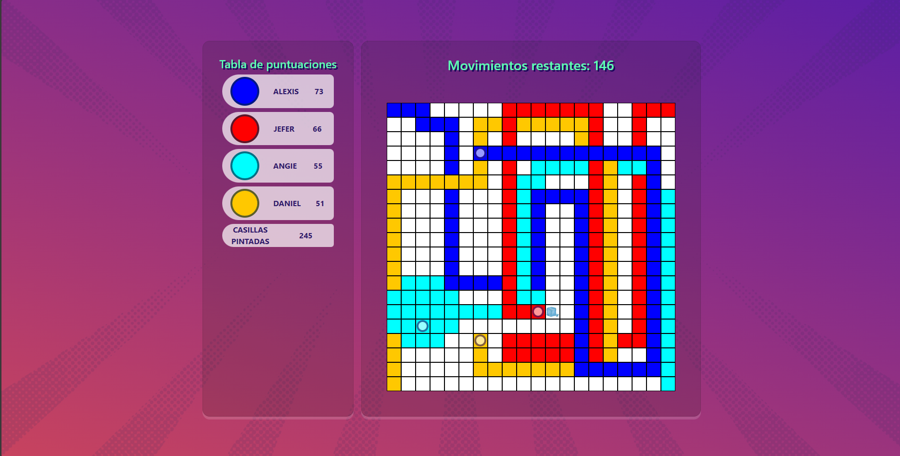
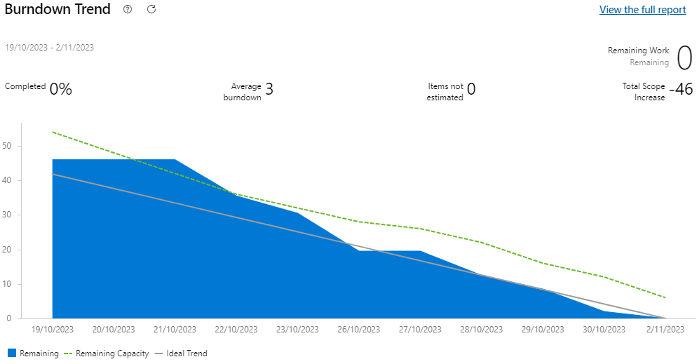
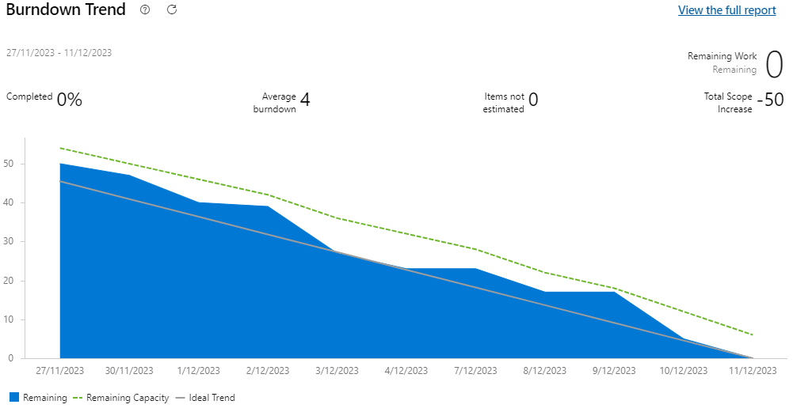
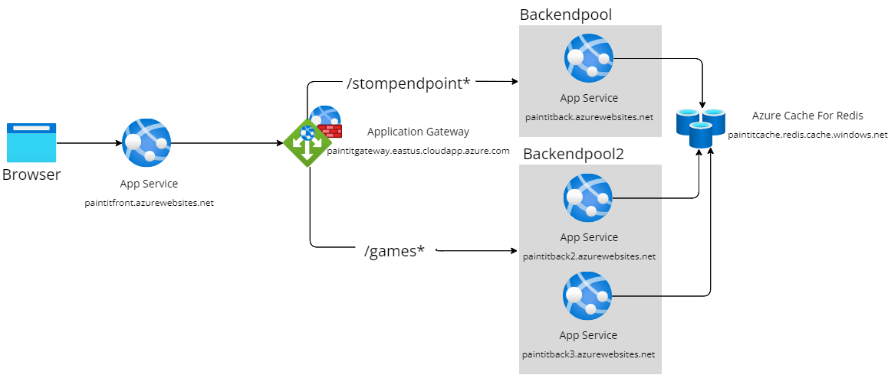

# Paint It!

Paint It! es un juego multijugador en tiempo real donde los jugadores compiten pintando casillas en un tablero compartido. El objetivo es pintar la mayor cantidad de casillas con tu color antes de que se acaben los movimientos. Para más información detallada sobre este y su arquitectura abre los archivos "Documento de Arquitectura PaintIt.pdf" y "PaintIt.asta".

El proyecto fue desarrollado como parte del curso de Arquitecturas de Software (ARSW) de la Escuela Colombiana de Ingeniería Julio Garavito. Consta de dos sprints de dos semanas cada uno.

## Requerimientos 

### Sprint 1 (19 de octubre - 2 de noviembre):

- Página de inicio
- Unión a partidas
- Sala de espera
- Tablero de juego
- Temporizador
- Tabla de clasificación

### Sprint 2 (27 de noviembre - 11 de diciembre):

- Escalabilidad horizontal en el backend (disponibilidad)
- Escenarios de seguridad (WAF y Caché)
- Revisión de código con SonarCloud (mantenibilidad)
- Creación de partidas
- Personalización de partida y jugador
- Comodines

## Tecnologías

### Frontend:

- HTML
- CSS
- JavaScript

### Backend:

- Java
- Spring Boot
- Spring Web
- Spring WebSockets
- Spring Data Redis

### Persistencia:

- Redis

### Testing:

- JUnit

### Integración continua:

- Maven
- JaCoCo
- SonarCloud
- Azure DevOps

### Infraestructura:

- Azure App Service
- Azure Cache for Redis
- Azure Application Gateway
- Azure Web Application Firewall

### Control de versiones:

- Git
- GitHub

## Arquitectura

La arquitectura del proyecto sigue un estilo cliente-servidor. El frontend se despliega en Azure App Service y consume APIs REST del backend, también desplegado en App Service.

Para mejorar la escalabilidad se implementó un Azure Application Gateway con Web Application Firewall. Las peticiones API y websockets se manejan en backends pools separados.

Se utiliza Azure Cache for Redis para almacenar rápidamente los estados del juego.

El código pasa por una revisión estática con SonarCloud en la integración continua.

## Guía de instalación

1. Crea un Azure Cache for Redis.
   - Habilita el puerto no TLS
   - El método de conectividad debe ser: Punto de conexión público.
2. Crea 4 Azure App Service, uno será para el front y los otros para el back. 
   - La pila de entorno de ejecución debe ser Java 17 y utiliza como pila de servidor web java Java SE (Embedded Web Server).
   - Configura las políticas de CORS.
   - Si usas Windows como sistema operativo para los APP Service habilita los websockets.
   - Deshabilita la opción de redirigir todo el tráfico de HTTP a HTTPS.
3. Crea un Azure Application Gateway.
   - Este debe tener dos backendpools uno que manejará las peticiones **/stompendpoint*** y otro las peticiones **/games***
   - En un backendpool deja un App Service y en el segundo los otros dos App Service. 
   - El protocolo debe ser HTTP y se debe usar el puerto 80.
   - Cambia la prueba de sondeo para que esta se haga a la ruta /games/boardsizes o /games/gametimes, y así comprobar que los backendpool esten respondiendo correctamente.
   - Habilitar WAF en modo prevención.
4. Clona repositorios de Git .
   - Frontend en: https://github.com/AlexisGR117/ARSW-Proyecto-Front.
   - Bakcend end: https://github.com/AlexisGR117/ARSW-Proyecto-Back.
5. Configura frontend.
   - Cambia la URL que está en **apiclient.js** en la variable baseURL por la que tiene asignada el Azure Application Gateway.
   - También se debe realizar el cambio de la URL donde se crean los sockets en **game.js**, **index.js**, **lobby.js** y **playercustomization.js**, manteniendo la ruta **/stompendpoint**.
6. Configurar backend.
   - Configura el application.properties con la información del caché que se creó.
   - Cambia las URL de **PaintItWebSocketConfig.java** para establecer los orígenes permitidos desde los cuales los clientes WebSocket pueden conectarse al endpoint.
7. Despliega el código correspondiente para cada App Service.
8. Acceder al frontend via el dominio del App Service.
9. ¡Diviértete jugando PaintIt con tus amigos!

## Autores

- Angie Natalia Mojica Diaz
- Daniel Antonio Santanilla Arias
- Jefer Alexis González Romero
